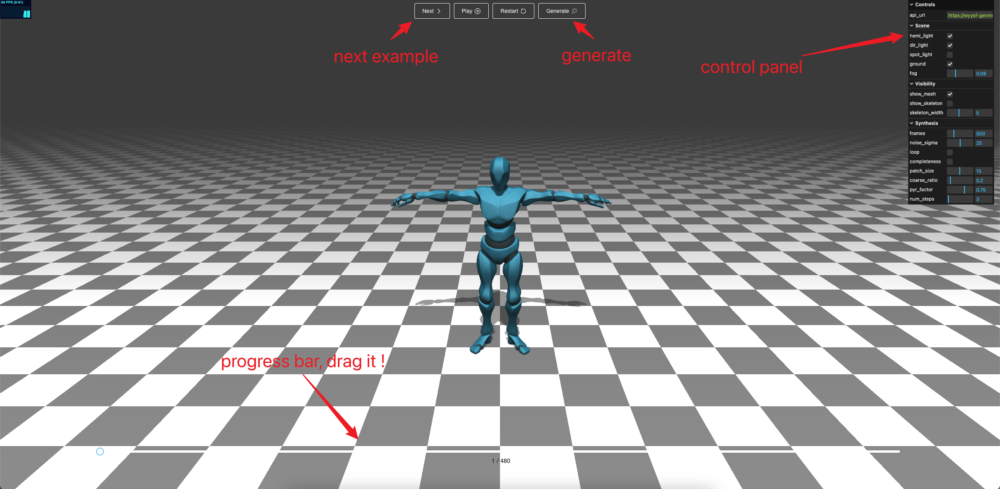
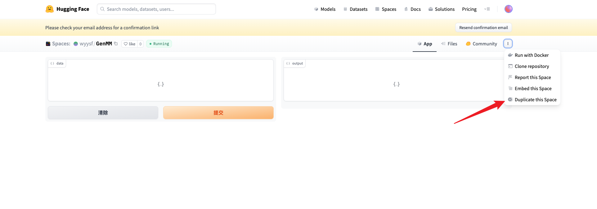
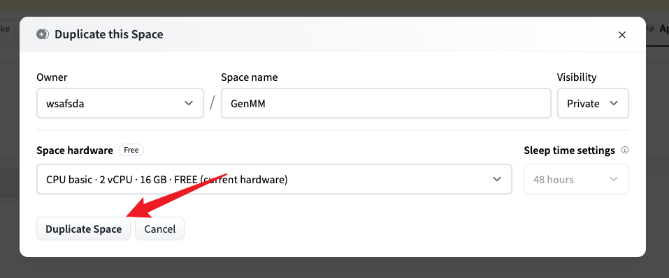
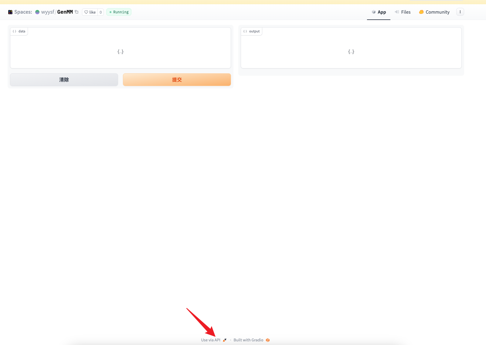
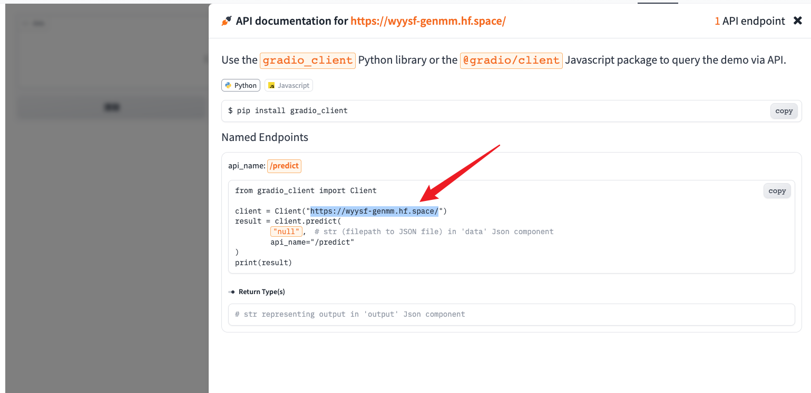
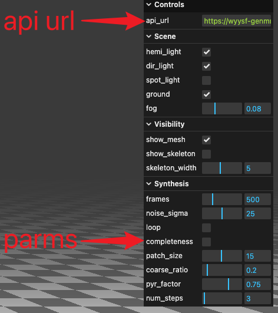

# This repo contains the web demo for the [GenMM](https://wyysf-98.github.io/GenMM)

:star: try it now [demo](https://wyysf-98.github.io/GenMM_demo)

### Overview

- at the top of the page is the 'Next', 'Pause', 'Restart' and 'Generate' buttons, you can click 'Next' to get the next example.
- you can also drag the progress bar at the bottom of the page.
- click 'Controls' to expand the control panel.
    - api-url: using hugging face space api for inference, if you get stuck, please try your own api.
    - Scene: control the light and ground of the scene.
    - Visibility: toggle the visibility of the mesh and skeleton.
    - Synthesis: parameters for the synthesis process. 
      - frames: number of frames to be synthesized.
      - noise_sigma: noise level to be synthesized.
      - loop: whether to loop the animation.
      - completeness: whether control the completeness of the results.
      - patch_size: size of the patch
      - coarse_ratio: the ratio of the frame number at coarset level to the input.
      - pyr_factor: the factor of the pyramid upsampling.
      - num__steps: number of steps during the optimization process.

### If you have been waiting for a long time for the results to be generated
try to fork the 🤗[hugging face space](https://huggingface.co/spaces/wyysf/GenMM) and use your own api.

#### step 1: create an account for the hugging face.

#### step 2: duplicate the space.

#### step 3: get your api url.

#### step 4: change the api_url and have fun.

